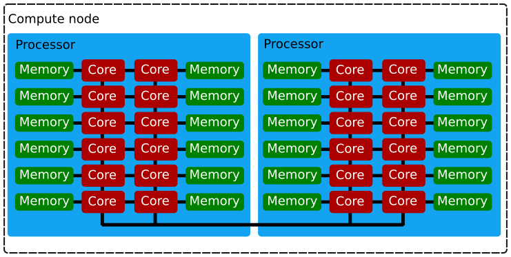

% Contemporary Supercomputers
% Juha Lento
% January 2, 2015

# Architecture

## Overview

## Compute node

## Vocabulary

- OS kernel ~ software layer between application programs and computer
  hardware, ++
- Process ~ single instance of a running program. Has it's own piece
  of allocated memory, and cannot directly read/write other process' memory
- Thread ~ one process may spawn multiple threads,
  to utilize more than a single core, for example. Threads spawned by the
  same process see the same memory addresses by default

## Vocabulary (cont.)

- Node ~ Workstation, running single operating system (OS) system image
- Processor ~ piece of silicon that is stuck on a socket on motherboard
- Core ~ similar to what used to be called CPU or processor
- Hyperthread ~ some cores have duplicated operational units, which allow
  them to execute two concurrent threads effectively

## Why should you care?

Understanding computer architecture helps in understanding

- how computers work, and why they work like they do
- how to use the system efficiently
- different parallel programming models

## Exercise

- log in to `sisu.csc.fi`

~~~~~~~~~~~~~~~~~~~~~~~~
> xtnodestat -m
~~~~~~~~~~~~~~~~~~~~~~~~

# What are they good for?

## Good for

- Parallel computing, massively parallel programs (MPP)
- farming, depending on intended usage profile
- large blocks of data, especially with MPI-IO and/or striping
- program development, with reservations
- running supported software

## Bad for

- unsupported sequential programs that require large, specific software stack,
  such as metview, pandoc, etc.
- frequent file metadata access
- the impatient --- some learning curve

## Exercise

- list the available software modules in sisu or taito
- module environment hierarchy and underlying 'philosophy' is different
  in taito and in sisu. How?

## Exercise answers

In taito:

~~~~~~~~~~~~
> module avail
> module spider 
~~~~~~~~~~~~

In sisu:

~~~~~~~~~~~~
> module avail
~~~~~~~~~~~~

# Future

## The trend

...is towards more and more cores on single compute node...

# Questions?

## Further reading

- <http://en.wikipedia.org/wiki/Parallel_computing>
- <https://research.csc.fi/csc-guide>