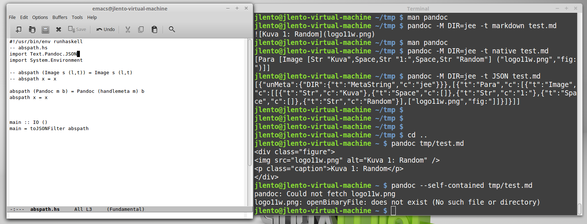

% Bash and Make
% Juha Lento
% January 23, 2015

# Level\ 0: Bash scripts as executable notes

## A way to work

## An example, Exercise\ 1:

~~~~{#bash-as-notes .bash}
#!/bin/bash
module purge
module load intel/15.0.0 intelmpi/5.0.1 mkl/11.2.0
mkdir -p $WRKDIR/oifs
cd $WRKDIR/oifs
tar xvf ${PATH_TO_ARCHIVE}/oifs38r1v04.tar.gz
cd oifs38r1v04/make
export PATH=$PATH:$WRKDIR/oifs/oifs38r1v04/fcm/bin
export OIFS_COMP=intel_mkl
export OIFS_BUILD=opt
export OIFS_GRIB_API_DIR="/appl/climate/intel1500"
fcm make --new -v -j 4 -f oifs.cfg
cd ../t21test
# Edit fort.4
export GRIB_SAMPLES_PATH= \
  /appl/climate/intel1500/share/grib_api/ifs_samples/grib1_mlgrib2
export LD_LIBRARY_PATH=$LD_LIBRARY_PATH:/appl/climate/intel1500/lib
srun -n 1 -p test -t 5 \
  $WRKDIR/oifs/oifs38r1v04/make/intel_mkl-opt/oifs/bin/master.exe -e epc8
~~~~

## The Good, the Bad, and the Ugly

- there actually is some notes! (the Good)
- script is very specific, re-do everything, non-parallel (the Bad)
- not even a mother would call this child beautiful (the Ugly)

### Do I need to make it pretty?

# Level\ 1: Readable bash scripts

## Some design ideas

- split the "notes" into "subroutines", possibly in different files
- use variables for values that you may want to change
- avoid repetition
- put the files into the right places
- todays exercise is to put ideas into practice!

*What other good programming practices do you know?*

# Level\ 2: Clever scripts

## A clever script

- does not do again something that already exists and is up to date
- does not fail for no real reason, and when fails for a good reason,
  clearly indicates why
- works for the next user, too
- works in an another computer, too
- quite a lot to ask

The most important rule:

** KEEP IT SIMPLE **

# More tools

## Sed and Awk

- like bash, sed and awk process data line by line
- part of the unix basic toolset, work well in command pipes
- very efficient when processing ascii data line by line

## Python, Matlab

- sure, why not?

## Make

- `make` can be used to make more clever workflow scripts
- in make programming you write dependency rules and recipes
- a rule simply declares a target file, it's prerequisite file(s),
  and a recipe how to do the target file from the prerequisite file(s)
- pattern matching, templates, metaprogramming, etc.

<https://www.gnu.org/software/make/manual/make.html>

## Makefile structure

1. set variables
2. define rules

~~~~{#make-structure .makefile}
VAR1 = ...
VAR2 = ...

TARGET : PREREQUISITES
       <recipe commands>

...
~~~~~

- We'll have a small make example in the post-processing part of the course.

# Attitude

## Why to write scripts

- to document what you have done
- share your work with colleagues
- make it easy to do the same, or almost same thing again
  (We do run comparison experiments quite often, don't we?)
- why else?
- why not?

## How to write scripts

- define what you want the script to do
- Google it
- ask a more experienced colleague how would he/she do it

## A script from a colleague

- most likely does not work
- ... because it contains details that are specific to the local
  set up of the colleague, filepaths, etc.
- still contains valuable information
- copy the script and modify it, or rewrite your own

*If (when) it does not work, fix it!*

# Questions?

## Further reading

- manuals, tutorials, man pages, internet, Google

