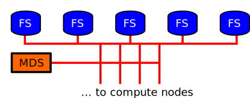

% Parallel file system
% Juha Lento
% January 30, 2015

Architecture
------------

- Parallel filesystem (Lustre) consists of a MetaData Server (MDS) and an array
  of large file servers (Object Data Server, ODS)

Practical limits
----------------

- MDS is a bottleneck for metadata access
  --> **#of files in single directory < 500**
- single node memory, i.e. how large data applications can load to memory
  is a few GBs --> **single file size <~ 1GB**
- full advantage from Lustre is achieved only with striping files over
  multiple ODS (default stripe = 1 in taito and sisu)
 
